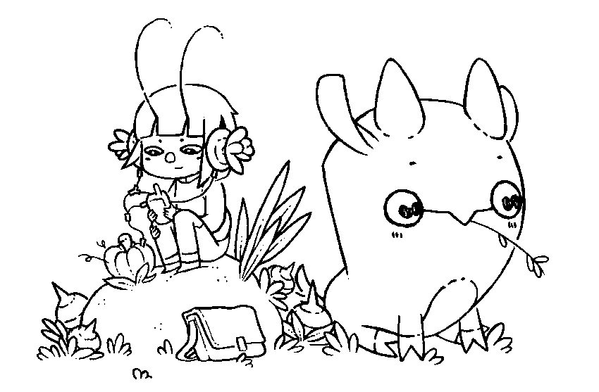
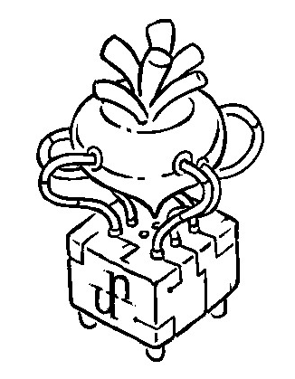

About Me
===

* Boen Shao
* Staff Software Engineer @ Berry AI
* I build Vision AI System at work
* At night, ...


<!-- end_slide -->

About the Creators of UXN
===

> Hundred Rabbits is an artist collective that documents low-tech solutions with the hope of building a more resilient future.
> We live and work aboard a 10m sailboat named Pino in remote parts of the world to learn more about how technology degrades beyond the shores of the western world.

<!-- new_lines: 5 -->
<!-- alignment: center -->


CC BY-NC-SA 4.0, https://100r.co/media/content/about/rabbits2.png

<!-- end_slide -->

What exactly is a "Virtual Machine"?
===

<!-- column_layout: [1, 1] -->
<!-- column: 0 -->

# System Virtual Machine

* Emulate a hardare system
* Makes the "binary" portable
* QEMU, PCSX2 (PS2), Dolphin (Wii)

<!-- column: 1 -->

# Process Virtual Machine

* Compilation target of a high-level language
* Makes the "code" portable
* JVM (Java), Common IL (.NET), BEAM (Erlang)

<!-- reset_layout -->
<!-- pause -->

# UXN is Neither

* UXN doesn't emulate existing hardwares, it has it's own spec
* UXN is designed to be programed in it's own assembly
* UXN is for FUN!

<!-- new_lines: 3 -->
<!-- alignment: center -->


CC BY-NC-SA 4.0, https://100r.co/media/interface/uxn.png

<!-- end_slide -->

Why UXN? What is the FUN?
===

* The reference implementation is just a single C file, super portable and hackable.
* The spec is minimal and can be implemented in an afternoon, making it a great subject for learning new language and platform.
* The **Uxntal** is a "concatenative" flavour assembly, quiet fun to program in. (Any forth fan here?)
* A great way to learn and explore the "essence of computing".

<!-- new_lines: 5 -->
<!-- alignment: center -->


CC BY-NC-SA 4.0, https://100r.co/media/interface/uxn.team.png

<!-- end_slide -->

The UXN/Varvara Ecosystem
===

# UXN - The CPU

* Stack based, no register
* Two stacks - working stack (*wst*) and return stack (*rst*)
* 16bit, 64kb of addressable memory, big-endian

# Varvara - The Peripherals

* Console, Screen, Audio, Controller, Mouse, File
* Memory-mapped, devices are controlled by reading/writing to memory addresses

<!-- new_lines: 3 -->
<!-- alignment: center -->


CC BY-NC-SA 4.0, https://wiki.xxiivv.com/media/generic/varvara.uxn.png

<!-- end_slide -->

Uxntal vs Python
===

<!-- column_layout: [1, 1] -->
<!-- column: 0 -->

# Uxntal

```text
LIT 03 ( -- 3 )
LIT 04 ( -- 3 4 )
ADD    ( -- 7 )
DUP    ( -- 7 7 )
MUL    ( -- 49 )
LIT 0a ( -- 49 10 )
DIV    ( -- 4 )
```

<!-- column: 1 -->

# Python

```python
a = 3
b = 4
c = a + b # 7
d = c * c # 49
e = 10
f = 49 // 10 # 4
```

<!-- reset_layout -->
<!-- pause -->
<!-- column_layout: [1, 1] -->
<!-- column: 0 -->

* Stack
* Stack Effect
* Composition

<!-- column: 1 -->

* Name/Reference
* Operator/Function
* Assignment

<!-- end_slide -->

The "Stack Effect"
===

# Composition

```text
DUP ( a   -- a a )
MUL ( a b -- a*b )
DUP MUL ( a -- a*a )
```

<!-- pause -->

# Associativity

```text
LIT 03 LIT 04 ADD DUP MUL LIT 0a DIV ( -- 4 )
LIT 03 LIT 04 ADD [ DUP MUL ] LIT 0a DIV ( -- 4 )
```

<!-- pause -->

# Macro

```text
%SQR { DUP MUL }
LIT 03 LIT 04 ADD SQR LIT 0a DIV ( -- 4 )
```

<!-- end_slide -->

The "Stack Effect" - cont'd
===

# What's the effect?

```text
LIT 03 ( -- 3 )
LIT 04 ( -- 3 4 )
OVR    ( -- 3 4 3 )
OVR    ( -- 3 4 3 4 )
GTH    ( -- 3 4 0 )
LIT 01 ( -- 3 4 0 1 )
JCN    ( -- 3 4 )
SWP    ( -- 4 3 )
POP    ( -- 4 )
```

<!-- pause -->

# MAX

```text
%MAX { OVR OVR GTH LIT 01 JCN SWP POP } ( a b -- max(a,b) )
LIT 03 LIT 04 MAX ( -- 4 )
```

<!-- end_slide -->

Opcode
===

# 32 Standard Opcodes

```text
                    EQU a b -- a=b'     LDZ a' -- M[a]        ADD a b -- a+b
INC a -- a+1        NEQ a b -- a≠b'     STZ a b' -- M[b]:a    SUB a b -- a-b
POP a --            GTH a b -- a>b'     LDR a' -- M[P+a]      MUL a b -- a×b
NIP a b -- b        LTH a b -- a<b'     STR a b' -- M[P+b]:a  DIV a b -- a÷b
SWP a b -- b a      JMP a -- P+:a       LDA a" -- M[a]        AND a b -- a&b
ROT a b c -- b c a  JCN a' b -- a?P+:b  STA a b" -- M[b]:a    ORA a b -- a|b
DUP a -- a a        JSR a -- P+:a .P"   DEI a' -- D[a]        EOR a b -- a^b
OVR a b -- a b a    STH a -- .a         DEO a b' -- D[b]:a    SFT a hl' -- a>>l<<h
```

# 8 Immediate Opcodes

```text
BRK -> P:0             LIT -- M[P]' P:P+1
JCI a' -- a?P:P+M[P]"  LIT2 -- M[P]" P:P+2
JMI -- P:P+M[P]"       LITr -- .M[P]' P:P+1
JSI -- P:P+M[P]" .P"   LIT2r -- .M[P]" P:P+2
```

#

* `value'` - byte length value
* `value"` - short length value
* `value` - length follows on mode
* `.` - return stack
* `P` - program counter
  * `P+:a` - jump by `a` in byte mode, set to `a` in short mode
* `M[addr]`, `D[addr]` - memory/device value at `addr`

<!-- end_slide -->

Opcode - cont'd
===

<!-- column_layout: [3, 2] -->
<!-- column: 0 -->

|     | 00     | 01     | 02     | 03     | 04     | 05     | 06     | 07     |
| --- | ------ | ------ | ------ | ------ | ------ | ------ | ------ | ------ |
| 00  | BRK    | INC    | POP    | NIP    | SWP    | ROT    | DUP    | OVR    |
| 10  | LDZ    | STZ    | LDR    | STR    | LDA    | STA    | DEI    | DEO    |
| 20  | JCI    | INC2   | POP2   | NIP2   | SWP2   | ROT2   | DUP2   | OVR2   |
| 30  | LDZ2   | STZ2   | LDR2   | STR2   | LDA2   | STA2   | DEI2   | DEO2   |
| 40  | JMI    | INCr   | POPr   | NIPr   | SWPr   | ROTr   | DUPr   | OVRr   |
| 50  | LDZr   | STZr   | LDRr   | STRr   | LDAr   | STAr   | DEIr   | DEOr   |
| 60  | JSI    | INC2r  | POP2r  | NIP2r  | SWP2r  | ROT2r  | DUP2r  | OVR2r  |
| 70  | LDZ2r  | STZ2r  | LDR2r  | STR2r  | LDA2r  | STA2r  | DEI2r  | DEO2r  |
| 80  | LIT    | INCk   | POPk   | NIPk   | SWPk   | ROTk   | DUPk   | OVRk   |
| 90  | LDZk   | STZk   | LDRk   | STRk   | LDAk   | STAk   | DEIk   | DEOk   |
| a0  | LIT2   | INC2k  | POP2k  | NIP2k  | SWP2k  | ROT2k  | DUP2k  | OVR2k  |
| b0  | LDZ2k  | STZ2k  | LDR2k  | STR2k  | LDA2k  | STA2k  | DEI2k  | DEO2k  |
| c0  | LITr   | INCkr  | POPkr  | NIPkr  | SWPkr  | ROTkr  | DUPkr  | OVRkr  |
| d0  | LDZkr  | STZkr  | LDRkr  | STRkr  | LDAkr  | STAkr  | DEIkr  | DEOkr  |
| e0  | LIT2r  | INC2kr | POP2kr | NIP2kr | SWP2kr | ROT2kr | DUP2kr | OVR2kr |
| f0  | LDZ2kr | STZ2kr | LDR2kr | STR2kr | LDA2kr | STA2kr | DEI2kr | DEO2kr |

|     | 08     | 09     | 0a     | 0b     | 0c     | 0d     | 0e     | 0f     |
| --- | ------ | ------ | ------ | ------ | ------ | ------ | ------ | ------ |
| 00  | EQU    | NEQ    | GTH    | LTH    | JMP    | JCN    | JSR    | STH    |
| 10  | ADD    | SUB    | MUL    | DIV    | AND    | ORA    | EOR    | SFT    |
| 20  | EQU2   | NEQ2   | GTH2   | LTH2   | JMP2   | JCN2   | JSR2   | STH2   |
| 30  | ADD2   | SUB2   | MUL2   | DIV2   | AND2   | ORA2   | EOR2   | SFT2   |
| 40  | EQUr   | NEQr   | GTHr   | LTHr   | JMPr   | JCNr   | JSRr   | STHr   |
| 50  | ADDr   | SUBr   | MULr   | DIVr   | ANDr   | ORAr   | EORr   | SFTr   |
| 60  | EQU2r  | NEQ2r  | GTH2r  | LTH2r  | JMP2r  | JCN2r  | JSR2r  | STH2r  |
| 70  | ADD2r  | SUB2r  | MUL2r  | DIV2r  | AND2r  | ORA2r  | EOR2r  | SFT2r  |
| 80  | EQUk   | NEQk   | GTHk   | LTHk   | JMPk   | JCNk   | JSRk   | STHk   |
| 90  | ADDk   | SUBk   | MULk   | DIVk   | ANDk   | ORAk   | EORk   | SFTk   |
| a0  | EQU2k  | NEQ2k  | GTH2k  | LTH2k  | JMP2k  | JCN2k  | JSR2k  | STH2k  |
| b0  | ADD2k  | SUB2k  | MUL2k  | DIV2k  | AND2k  | ORA2k  | EOR2k  | SFT2k  |
| c0  | EQUkr  | NEQkr  | GTHkr  | LTHkr  | JMPkr  | JCNkr  | JSRkr  | STHkr  |
| d0  | ADDkr  | SUBkr  | MULkr  | DIVkr  | ANDkr  | ORAkr  | EORkr  | SFTkr  |
| e0  | EQU2kr | NEQ2kr | GTH2kr | LTH2kr | JMP2kr | JCN2kr | JSR2kr | STH2kr |
| f0  | ADD2kr | SUB2kr | MUL2kr | DIV2kr | AND2kr | ORA2kr | EOR2kr | SFT2kr |

<!-- column: 1 -->

*2* - short mode operates on shorts, instead of bytes.\
*k* - keep mode operates without consuming items.\
*r* - return mode operates on the return stack.

<!-- new_lines: 5 -->
<!-- alignment: center -->


CC BY-NC-SA 4.0, \
https://wiki.xxiivv.com/media/generic/uxn.beet.png

<!-- end_slide -->

Memory and Devices
===

<!-- column_layout: [1, 1] -->
<!-- column: 0 -->

# 4 Sections

* Working Stack (wst) - 256 bytes
* Return Stack (rst) - 256 bytes
* Device Page - 256 bytes (16 devices * 16 ports)
* Addressable - 64kb

<!-- column: 1 -->

# Some specifics

* Big-endian
* A page is 256 bytes
* Rom is loaded at 0x0100, which is the address of the **Reset Vector**.
* At boot, the stacks, device and addressable memories are zeroed.
* When soft-reboot, the zero-page (0x00-0xff) is preserved.

<!-- reset_layout -->
<!-- pause -->

# Varvara Devices

<!-- alignment: center -->

|     | 00 [ System ] | 10 [ Console ] | 20 [ Screen ] | 30-60 [ Audio ] | 80 [ Controller ] | 90 [ Mouse ] | a0,b0 [ File ] | c0 [ Datetime ] |
| --- | ------------- | -------------- | ------------- | --------------- | ----------------- | ------------ | -------------- | --------------- |
| 00  |               | vector*        | vector*       | vector*         | vector*           | vector*      | vector*        | year*           |
| 01  |               |                |               |                 |                   |              |                |                 |
| 02  | expansion*    | read           | width*        | position*       | button            | x*           | success*       | month           |
| 03  |               |                |               |                 | key               |              |                | day             |
| 04  | wst           |                | height*       | output          |                   | y*           | stat*          | hour            |
| 05  | rst           |                |               |                 |                   |              |                | minute          |
| 06  | metadata*     |                | auto          |                 |                   | state        | delete         | second          |
| 07  |               | type           |               |                 |                   |              | append         | dotw            |
| 08  | red*          | write          | x*            | adsr*           |                   |              | name*          | doty            |
| 09  |               | error          |               |                 |                   |              |                |                 |
| 0a  | green*        |                | y*            | length*         |                   | scrollx*     | length*        | isdst           |
| 0b  |               |                |               |                 |                   |              |                |                 |
| 0c  | blue*         |                | addr*         | addr*           |                   | scrolly*     | read*          |                 |
| 0d  |               |                |               |                 |                   |              |                |                 |
| 0e  | debug         |                | pixel         | volume          |                   |              | write*         |                 |
| 0f  | state         |                | sprite        | pitch           |                   |              |                |                 |

<!-- alignment: left -->
<!-- pause -->

<!-- new_lines: 1 -->
# In Uxntal

```text
|00 @System/vector $2 &expansion $2 &wst $1 &rst $1 &metadata $2 &r $2 &g $2 &b
|10 @Console/vector $2 &read $5 &type $1 &write $1 &error $1
|20 @Screen/vector $2 &width $2 &height $2 &auto $2 &x $2 &y $2 &addr $2 &pixel $1 &sprite $1
|30 @Audio0/vector $2 &position $2 &output $1 &pad $3 &adsr $2 &length $2 &addr $2 &volume $1 &pitch $1
|40 @Audio1/vector $2 &position $2 &output $1 &pad $3 &adsr $2 &length $2 &addr $2 &volume $1 &pitch $1
|50 @Audio2/vector $2 &position $2 &output $1 &pad $3 &adsr $2 &length $2 &addr $2 &volume $1 &pitch $1
|60 @Audio3/vector $2 &position $2 &output $1 &pad $3 &adsr $2 &length $2 &addr $2 &volume $1 &pitch $1
|80 @Controller/vector $2 &button $1 &key $1
|90 @Mouse/vector $2 &x $2 &y $2 &state $4 &scrollx $2 &scrolly
|a0 @File1/vector $2 &success $2 &stat $2 &delete $1 &append $1 &name $2 &length $2 &read $2 &write $2
|b0 @File2/vector $2 &success $2 &stat $2 &delete $1 &append $1 &name $2 &length $2 &read $2 &write $2
|c0 @DateTime/year $2 &month $1 &day $1 &hour $1 &minute $1 &second $1 &dotw $1 &doty $2 &isdst $1
|100 @on-reset
```

<!-- end_slide -->

Putting it Together
===

<!-- end_slide -->